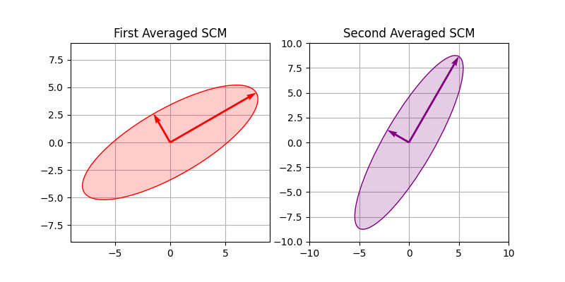
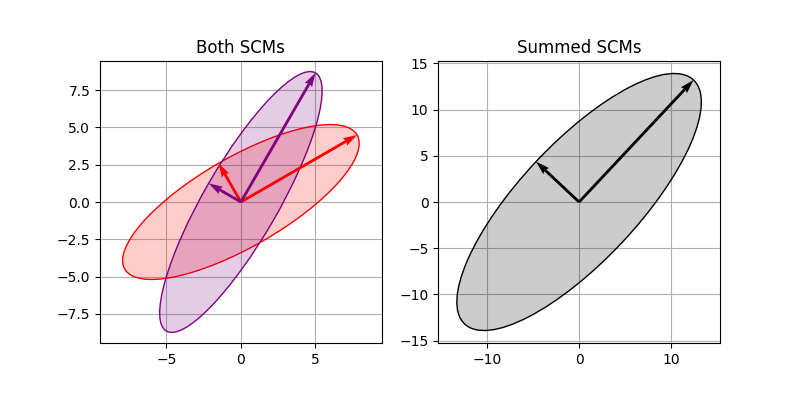
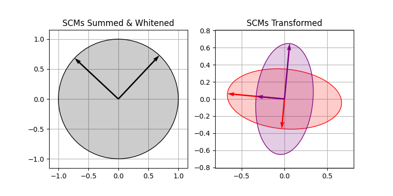

> *Adapted from an appendix of my MS thesis. Equations render via Dev.to's KaTeX support.*

# Common Spatial Pattern

## Correctness Proof

The common spatial pattern (CSP) allows one to maximize the variance of signals from one condition and at the same time minimize the variance of signals from another condition [1]. For example, consider two three-dimensional tensors (\text{trials} \times \text{channels} \times \text{time}) of electroencephalogram (EEG) from separate classes \boldsymbol{X}_ 1,\boldsymbol{X}_ 2\in\mathbb{R}^ {p \times q \times r}. For each trial let us assume zero mean and compute between channel across time sample covariance matrices (SCMs) \boldsymbol{\Sigma}_ i^ {(k)}=\frac{1}{r-1}\boldsymbol{X}_ i^ {(k)}\boldsymbol{X}_ i^ {(k)\top}\in\mathbb{R}^ {q \times q} for i=1,2 and k=1,\ldots,p. Furthermore, let us take \bar{\boldsymbol{\Sigma}}_ i\in\mathbb{R}^ {q \times q} as the arithmetic mean SCM for each class across all trials k.

Our example is a standard data and preprocessing pipeline for CSP used by software libraries like PyRiemann [2]. We assume the SCMs are conditioned so that they are symmetric positive definite (SPD). By definition, for a matrix \boldsymbol{A}\in\mathbb{R}^ {n \times n} and any non-zero vector \boldsymbol{x}\in\mathbb{R}^ n, if \boldsymbol{A}=\boldsymbol{A}^ \top and \boldsymbol{x}^ \top\boldsymbol{A}\boldsymbol{x}>0, then \boldsymbol{A} is SPD. As a result, all eigenvalues are positive \lambda_ i > 0 from the eigendecomposition \boldsymbol{A}=\boldsymbol{Q}\boldsymbol{D}\boldsymbol{Q}^ \top where \boldsymbol{D} = \text{diag}(\lambda_ 1,\ldots,\lambda_ n) [3]. Furthermore, the sum of two SPD matrices \boldsymbol{A},\boldsymbol{B}\in\mathbb{R}^ {n \times n} is also SPD since \boldsymbol{x}^ \top(\boldsymbol{A}+\boldsymbol{B})\boldsymbol{x}=\boldsymbol{x}^ \top\boldsymbol{A}\boldsymbol{x} + \boldsymbol{x}^ \top\boldsymbol{B}\boldsymbol{x} > 0. Let us diagonalize the mean SCMs from our example.


\bar{\boldsymbol{\Sigma}}_ 1+\bar{\boldsymbol{\Sigma}}_ 2 = \boldsymbol{V}\boldsymbol{\Lambda}\boldsymbol{V}^ \top.


The whitening transformation of an SCM results in zero mean, unit variance, and zero covariance [1]. In other words, the whitening transformation maps an SCM to the identity matrix \boldsymbol{\Sigma}\mapsto\boldsymbol{I}. We define the whitening matrix as \boldsymbol{W} = \boldsymbol{V}\boldsymbol{\Lambda}^ {-1/2}\boldsymbol{V}^ \top \in \mathbb{R}^ {n \times n}. The result is no longer an ellipse when plotted but rather the unit circle.


\boldsymbol{W}(\bar{\boldsymbol{\Sigma}}_ 1+\bar{\boldsymbol{\Sigma}}_ 2)\boldsymbol{W}^ \top = \boldsymbol{V}\boldsymbol{\Lambda}^ {-1/2}\boldsymbol{V}^ \top(\boldsymbol{V}\boldsymbol{\Lambda}\boldsymbol{V}^ \top)\boldsymbol{V}\boldsymbol{\Lambda}^ {-1/2}\boldsymbol{V}^ \top = \boldsymbol{I}.


We can rewrite our whitening transformation to show that the variance of the signals in our first class \bar{\boldsymbol{\Sigma}}_ 1 is maximized, while the variance of the signals in our second class \bar{\boldsymbol{\Sigma}}_ 2 is also minimized. We do this by distributing the whitening matrix throughout the sum of our SCMs. The result is two transformed SCMs we denote by \bar{\boldsymbol{\Sigma}}_ 1',\bar{\boldsymbol{\Sigma}}_ 2'\in\mathbb{R}^ {n \times n} whose sum is the identity matrix.


\boldsymbol{W}(\bar{\boldsymbol{\Sigma}}_ 1+\bar{\boldsymbol{\Sigma}}_ 2)\boldsymbol{W}^ \top = \boldsymbol{W}\bar{\boldsymbol{\Sigma}}_ 1\boldsymbol{W}^ \top + \boldsymbol{W}\bar{\boldsymbol{\Sigma}}_ 2\boldsymbol{W}^ \top = \bar{\boldsymbol{\Sigma}}_ 1' + \bar{\boldsymbol{\Sigma}}_ 2' = \boldsymbol{I}.


Let us use \boldsymbol{V}_ i'\boldsymbol{\Lambda}_ i'\boldsymbol{V}_ i'^ \top where i=1,2 to denote the diagonalization of our transformed SCMs. Since \bar{\boldsymbol{\Sigma}}_ 1' + \bar{\boldsymbol{\Sigma}}_ 2' = \boldsymbol{I} the sum of the diagonals d_ {ij} = \text{diag}(\boldsymbol{\Lambda}_ i')_ j is d_ {1j}+d_ {2j}=1. Furthermore, d_ {ij}>0 since \bar{\boldsymbol{\Sigma}}_ i' is SPD. Therefore, the diagonals are bounded between 0 and 1. When the variance d_ {aj} \gg d_ {bj} for a \neq b, the classification problem is more or less solved for unseen EEG trials. However, when d_ {aj} is close to d_ {bj} the discrimination between classes is more ambiguous [1].

## References

1. Benjamin Blankertz (2018) *Gentle Introduction to Signal Processing and Classification for Single-Trial EEG Analysis*. CRC Press.
2. Alexandre Barachant, Quentin Barthélemy, Jean-Rémi King, Alexandre Gramfort, Sylvain Chevallier, Pedro L. C. Rodrigues, Emanuele Olivetti, Vladislav Goncharenko, Gabriel Wagner vom Berg, Ghiles Reguig, Arthur Lebeurrier, Erik Bjäreholt, Maria Sayu Yamamoto, Pierre Clisson, Marie-Constance Corsi, Igor Carrara, Apolline Mellot, Bruna Junqueira Lopes, Brent Gaisford, Ammar Mian, Anton Andreev, Gregoire Cattan, Arthur Lebeurrier (2025) *pyRiemann*. Zenodo.
3. Kevin P. Murphy (2022) *Probabilistic Machine Learning: An Introduction*. MIT Press.
