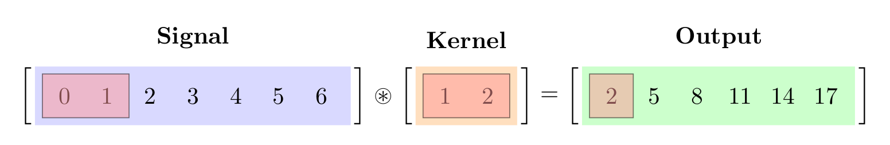
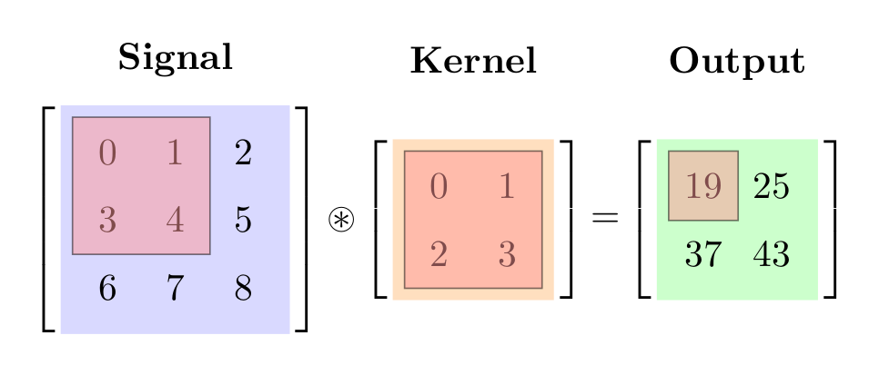

> *Adapted from an appendix of my MS thesis.*

## Convolutional Neural Network

The convolutional neural network (CNN) is used to apply neural networks for images. In this case, we replace matrix multiplication with a convolution operation. The basic idea is to divide the input into overlapping 2D image patches, and to compare each patch with a set of small weight matrices, or filters, which represents part of an object [1].

This can be thought of as a form of template matching. We learn these templates from data. Since the templates are small (often just 3 \times 3 or 5 \times 5), the number of parameters needed for learning is small. Additionally, since we use convolution to do template matching, instead of matrix multiplication, the model will be translationally invariant. This is useful for tasks such as image classification, where the goal is to classify if an object is present regardless of its location [1].

The 1D convolution between two function f,g:\mathbb{R}^ D\to\mathbb{R} is defined as follows [1].


\lbrack f \circledast g \rbrack(z) = \int_ {\mathbb{R}^ D}f(u)g(z-u)\mathrm{d}u.


Now suppose we replace the functions with finite-length vectors, which we can think of as functions defined on a finite set of points. Let f be evaluated at the points \\{-L,-L+1,\ldots,0,1,\ldots,L\\} to yield the weight vector (also called a filter or kernel) w_ {-L}=f(-L) up to w_ L=f(L). Now let g be evaluated at the points \\{-N,\ldots,N\\} to yield the feature vector x_ {-N}=g(-N) up to x_ N=g(N). Then the equation becomes the following. We see that we flip the weight vector \boldsymbol{w}, and then drag it over the the \boldsymbol{x} vector, summing up the local windows at each point [1].


\lbrack \boldsymbol{w}\circledast\boldsymbol{x} \rbrack(i) = w_ {-L}x_ {i+L}+\cdots+w_ {-1}x_ {i+1}+w_ 0x_ i+w_ 1x_ {i-1}+\cdots+w_ Lx_ {i-L}.


When we do not flip \boldsymbol{w} first, then we get the cross correlation [1].


\lbrack \boldsymbol{w}\circledast\boldsymbol{x} \rbrack(i) = w_ {-L}x_ {i-L}+\cdots+w_ {-1}x_ {i-1}+w_ 0x_ i+w_ 1x_ {i+1}+\cdots+w_ Lx_ {i+L}.


If the weight vector is symmetric, then cross correlation and convolution are the same. In the deep learning literature, the term “convolution” is often used to mean cross correlation. We can also evaluate the weights \boldsymbol{w} on the domain \\{0,1,\ldots,L-1\\} and the features \boldsymbol{x} on the domain \\{0,1,\ldots,N-1\\}, to eliminate negative indices [1].


\lbrack \boldsymbol{w}\circledast\boldsymbol{x} \rbrack(i) = \sum_ {u=0}^ {L-1}w_ ux_ {i+u}.


In 2D, the equation becomes the following where the 2D filter \boldsymbol{W} has size H \times W [1].


\lbrack \boldsymbol{W}\circledast\boldsymbol{X} \rbrack(i,j) = \sum_ {u=0}^ {H-1}\sum_ {v=0}^ {W-1}w_ {u,v}x_ {i+u,j+v}.


We can think of 2D convolution as template matching, since the output at a point (i,j) will be large if the corresponding image centered on (i,j) is similar to \boldsymbol{W}. More generally, we can think of convolution as a form of feature detection. The resulting output \boldsymbol{Y}=\boldsymbol{W}\circledast\boldsymbol{X} is therefore called a feature map [1].

In the figure we see that convolving a 3 \times 3 image with a 2 \times 2 filter results in a 2 \times 2 output. This is called valid convolution, since we only apply the filter to valid parts of the input, and we do not let it slide off the ends. If we want the output to have the same size as the input, we can use zero-padding, where we add a border of zeros to the image. This is called same convolution [1].

![The first 6 of 25 convolutions with padding [2].](assets/dnn-cnn/padding-grid.png)

Since each output pixel is generated by a weighted combination of inputs in its receptive field, neighboring outputs will be very similar in value, since their inputs are overlapping. We can reduce this redundancy and speedup computation by skipping every s number of inputs. This is called strided convolution [1].

![The first 6 in 9 convolutions with padding and strides [2].](assets/dnn-cnn/strides-grid.png)

Convolution will preserve information about the location of input features, a property known as equivariance. In some cases we want to be invariant to the location. For example, when performing image classification, we may just want to know if an object of interest is present anywhere in the image. A simple way to achieve this is called max pooling, which computes the maximum over its incoming values. An alternative is to use average pooling, which replaces the maximum with the mean. A common design pattern is to create a CNN by alternating convolutional layers with max pooling layers, followed by a final linear classification layer at the end [1].

![Max pooling [3].](assets/dnn-cnn/max-pooling.png)

## References

1. Kevin P. Murphy (2022) *Probabilistic Machine Learning: An Introduction*. MIT Press.
2. Dumoulin, Vincent, Visin, Francesco (2016) *A guide to convolution arithmetic for deep learning*. ArXiv e-prints.
3. Aphex34 (2015) *Max pooling*.
