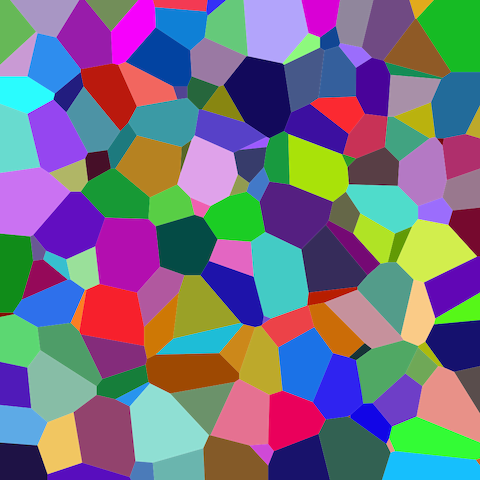

> *Adapted from an appendix of my MS thesis.*

# Deep Neural Network

Examples of machine learning (ML) models include logistic regression corresponding to the model p(y|\boldsymbol{x},\boldsymbol{w})=\operatorname{Ber}(y|\sigma(\boldsymbol{w}^ \top\boldsymbol{x})) and generalized linear models (GLMs) which generalizes to other kinds of output distributions such as Poisson. However, these models make the strong assumption that the input-output mapping is linear. A simple way of increasing the flexibility of such models is to perform a feature transformation, by replacing \boldsymbol{x} with \phi(\boldsymbol{x}). For example, we can use a polynomial transform, given by \phi(\boldsymbol{x})=[1,\boldsymbol{x},\boldsymbol{x}^ 2,\boldsymbol{x}^ 3,\ldots]. This is called basis function expansion and the model becomes the following [1].


f(\boldsymbol{x};\boldsymbol{\theta})=\boldsymbol{W}\phi(\boldsymbol{x})+\boldsymbol{b}.


The updated model still linear in the parameters \boldsymbol{\theta}=(\boldsymbol{W},\boldsymbol{b}). This makes model fitting easy, however, having to specify the feature transformation by hand is very limiting. A natural extension is to give the feature extractor its own parameter \boldsymbol{\theta}_ 2 giving the following where \boldsymbol{\theta}=(\boldsymbol{\theta}_ 1,\boldsymbol{\theta}_ 2) and \boldsymbol{\theta}_ 1=(\boldsymbol{W},\boldsymbol{b}) [1].


f(\boldsymbol{x};\boldsymbol{\theta})=\boldsymbol{W}\phi(\boldsymbol{x};\boldsymbol{\theta}_ 2)+\boldsymbol{b}.


This process can be repeated recursively to create more and more complex functions, and if we compose L functions we get the following where f_ \ell(\boldsymbol{x})=f(\boldsymbol{x};\boldsymbol{\theta}_ \ell) is the function at layer \ell [1].


f(\boldsymbol{x};\boldsymbol{\theta}) = f_ L(f_ {L-1}(\cdots (f_ 1(\boldsymbol{x})) \cdots)).


This is the key idea behind deep neural networks (DNNs). The term “DNN” actually encompasses a larger family of models in which we compose differentiable functions into any kind of directed acyclic graph (DAG) mapping input to output. The equation is the simplest example where the DAG is a chain. This is known as a feedforward neural network (FFNN) or multilayer perceptron (MLP) and assumes that the input is a fixed-dimensional vector such as \boldsymbol{x}\in\mathbb{R}^ D [1].

![A multilayer perceptron (MLP) [2].](assets/dnn-mlp/dnn.png)

Historically, the perceptron is a deterministic version of logistic regression with a mapping of the following form where H(\cdot) is the Heaviside step function, also known as a linear threshold function [1].


f(\boldsymbol{x};\boldsymbol{\theta})
= \boldsymbol{1}(\boldsymbol{w}^ \top\boldsymbol{x}+b \geq 0)
= H(\boldsymbol{w}^ \top\boldsymbol{x}+b).


In this form, the MLP is a stack of perceptrons, each of which involves the non-differentiable Heaviside function. This makes models difficult to train, which is why it has never been widely used. However, we can replace the Heaviside function H:\mathbb{R}\to\\{0,1\\} with a differentiable activation function \varphi:\mathbb{R}\to\mathbb{R}. More precisely, we define the hidden units \boldsymbol{z}_ l at each layer l to be a linear transformation of the hidden units at the previous layer passed elementwise through this activation function [1].


\boldsymbol{z}_ l=f_ l(\boldsymbol{z}_ {l-1})=\varphi_ l(\boldsymbol{b}_ l+\boldsymbol{W}_ l\boldsymbol{z}_ {l-1}).


The quantity that is passed to the activation function is called the pre-activations [1].


\boldsymbol{a}_ l=\boldsymbol{b}_ l+\boldsymbol{W}_ l\boldsymbol{z}_ {l-1}.


If we now compute L of these functions together, as in the equation, then we can compute the gradient of the output with respect to the parameters in each layer using the chain rule, also known as backpropagation. We can then pass the gradient to an optimizer, and thus minimize some training objective. The term “MLP” almost always refers to this differentiable form of the model, rather than the historical version with non-differentiable linear threshold units [1].

We are free to use any kind of differentiable activation function at each layer. However, if we use a linear activation function, then the whole model reduces to a regular linear model. In the early days of neural networks, a common choice of activation function was to use a sigmoid (logistic) function, which can be seen as a smooth approximation of the Heaviside function [1].


\sigma(a) = \frac{1}{1+e^ {-a}}.


However, the sigmoid function saturates at 1 for large positive inputs, and at 0 for large negative inputs. Another common choice is the tanh function, which has a similar shape, but saturates at -1 and 1. In the saturated regimes, the gradient of the output with respect to the input will be close to zero, so any gradient signal from higher layers will not be able to propagate back to earlier layers. This is called the vanishing gradient problem, and it makes it hard to train the model using gradient descent [1].

One of the keys to train very deep models is to use non-saturating activation functions. The most common of these is rectified linear unit (ReLU). The ReLU functions simply turns off negative inputs, and passes positive inputs unchanged [1].


\operatorname{ReLU}(a)
= \max(a,0)
= a\boldsymbol{1}(a>0).


It can be shown that an MLP with one hidden layer is a universal function approximator, meaning it can model any suitably smooth function, given enough hidden units, to any desired level of accuracy. Intuitively, the reason for this is that each hidden unit can specify a half plane, and a sufficiently large combination of these can divide any region of space, to which any response can be associated [1].

*Voronoi diagram visualization of the universal function approximation, where each hidden unit specifies a half plane [3].*

However, various arguments, both experimental and theoretical, have shown that deep networks work better than shallow ones. The reason is that later layers can leverage the features that are learned by earlier layers. That is, the function is defined in a compositional or hierarchical way. Although we could fit any dataset with a single hidden layer model, intuitively, it is easier if the model learns to detect the separating characteristics of the dataset using the hidden units in an early layer, and then uses these features to define a simple linear classifier in a later layer [1].

## References

1. Kevin P. Murphy (2022) *Probabilistic Machine Learning: An Introduction*. MIT Press.
2. BrunelloN (2021) *Example of a deep neural network*.
3. Jahobr (2017) *Coloured Voronoi 3D slice*.
