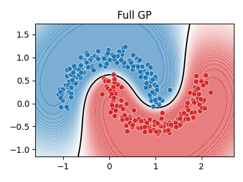
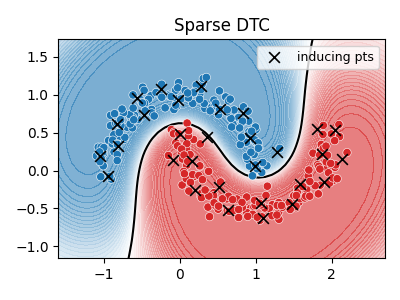

> *Adapted from an appendix of my MS thesis.*

## Sparse Approximation

The best way to perform GP inference and training is to compute a Cholesky decomposition of the N \times N Gram matrix. Unfortunately, this take \mathcal{O}(N^ 3) time. Instead, we can use an approximation method based on inducing points, also called pseudoinputs, which are like a learned summary of the training data that we can condition on, rather than conditioning on all of it [1].

Let \boldsymbol{X} be the observed inputs, and \boldsymbol{f}_ X=f(\boldsymbol{X}) be the unknown vector of function values for which we have observations \boldsymbol{y}. Let \boldsymbol{f}_ \ast be the unknown function values at one or more test points \boldsymbol{X}_ \ast. Finally, let us assume we have M additional inputs \boldsymbol{Z} with unknown function values \boldsymbol{f}_ Z also denoted by \boldsymbol{u}. The exact joint prior has the following form [1].


p(\boldsymbol{f}_ X,\boldsymbol{f}_ \ast)
= \int p(\boldsymbol{f}_ \ast,\boldsymbol{f}_ X,\boldsymbol{f}_ Z)\mathrm{d}\boldsymbol{f}_ Z
= \int p(\boldsymbol{f}_ \ast,\boldsymbol{f}_ X|\boldsymbol{f}_ Z)p(\boldsymbol{f}_ Z)\mathrm{d}\boldsymbol{f}_ Z
= \mathcal{N}\left(\boldsymbol{0},
\begin{pmatrix}
\boldsymbol{K}_ {X,X} & \boldsymbol{K}_ {X,\ast} \\\\
\boldsymbol{K}_ {\ast,X} & \boldsymbol{K}_ {\ast,\ast} \\\\
\end{pmatrix}
\right).


We can choose \boldsymbol{f}_ Z in such a way that it acts as a sufficient statistic for the data, so that we can predict \boldsymbol{f}_ \ast just using \boldsymbol{f}_ Z instead of \boldsymbol{f}_ X, and thus we approximate the prior as follows [1].


p(\boldsymbol{f}_ \ast,\boldsymbol{f}_ X,\boldsymbol{f}_ Z)
= p(\boldsymbol{f}_ \ast|\boldsymbol{f}_ X,\boldsymbol{f}_ Z)p(\boldsymbol{f}_ X|\boldsymbol{f}_ Z)p(\boldsymbol{f}_ Z)
\approx p(\boldsymbol{f}_ \ast|\boldsymbol{f}_ Z)p(\boldsymbol{f}_ X|\boldsymbol{f}_ Z)p(\boldsymbol{f}_ Z).


From this we derive the following train and test conditionals [1].


\begin{aligned}
p(\boldsymbol{f}_ X|\boldsymbol{f}_ Z) &= \mathcal{N}(\boldsymbol{f}_ X|\boldsymbol{K}_ {X,Z}\boldsymbol{K}_ {Z,Z}^ {-1}\boldsymbol{f}_ Z,\boldsymbol{K}_ {X,X}-\boldsymbol{Q}_ {X,X}) \\\\
p(\boldsymbol{f}_ \ast|\boldsymbol{f}_ Z) &= \mathcal{N}(\boldsymbol{f}_ \ast|\boldsymbol{K}_ {\ast,Z}\boldsymbol{K}_ {Z,Z}^ {-1}\boldsymbol{f}_ Z,\boldsymbol{K}_ {\ast,\ast}-\boldsymbol{Q}_ {\ast,\ast}).\end{aligned}


The above equations can be seen as exact inference on noise-free observations \boldsymbol{f}_ Z. To gain computational speedups, we can make further approximations to the terms \tilde{\boldsymbol{Q}}_ {X,X}=\boldsymbol{K}_ {X,X}-\boldsymbol{Q}_ {X,X} and \tilde{\boldsymbol{Q}}_ {\ast,\ast}=\boldsymbol{K}_ {\ast,\ast}-\boldsymbol{Q}_ {\ast,\ast}. We can then derive the approximate prior q(\boldsymbol{f}_ X,\boldsymbol{f}_ \ast)=\int q(\boldsymbol{f}_ X|\boldsymbol{f}_ Z)q(\boldsymbol{f}_ \ast|\boldsymbol{f}_ Z)p(\boldsymbol{f}_ Z)\mathrm{d}\boldsymbol{f}_ Z, which we then condition on the observations in the usual way. All of these approximations result in a training cost of \mathcal{O}(M^ 3+NM^ 2), and then take \mathcal{O}(M) time for the predictive mean for each test case, and \mathcal{O}(M^ 2) time for the predictive variance. Compare this to \mathcal{O}(N^ 3) training time and \mathcal{O}(N) and \mathcal{O}(N^ 2) testing time for exact inference [1].

The deterministic inducing conditional (DIC) approximation, or the subset of regressors (SOR) approximation, results from assuming \tilde{\boldsymbol{Q}}_ {X,X}=\boldsymbol{0} and \tilde{\boldsymbol{Q}}_ {\ast,\ast}=\boldsymbol{0}, so the conditionals are deterministic. This can result in an underestimate of the predictive variance. One way to overcome the overconfidence of DIC is to only assume \tilde{\boldsymbol{Q}}_ {X,X}=\boldsymbol{0} but let \tilde{\boldsymbol{Q}}_ {\ast,\ast}=\boldsymbol{K}_ {\ast,\ast}-\boldsymbol{Q}_ {\ast,\ast} be exact. This is called the deterministic training conditional (DTC). Lastly, the fully independent training conditional (FITC) approximation assumes q(\boldsymbol{f}_ X|\boldsymbol{f}_ Z) is fully factorized. This throws away less uncertainty than the SOR and DTC methods, since it does not make any deterministic assumptions about the relationship between \boldsymbol{f}_ X and \boldsymbol{f}_ Z [1].


\begin{aligned}
q_ {\mathrm{SOR}}(\boldsymbol{f}_ X,\boldsymbol{f}_ \ast) &= \mathcal{N}\left(\boldsymbol{0},
\begin{pmatrix}
\boldsymbol{Q}_ {X,X} & \boldsymbol{Q}_ {X,\ast} \\\\
\boldsymbol{Q}_ {\ast,X} & \boldsymbol{Q}_ {\ast,\ast} \\\\
\end{pmatrix}
\right) \\\\
q_ {\mathrm{DTC}}(\boldsymbol{f}_ X,\boldsymbol{f}_ \ast) &=
\mathcal{N}\left(\boldsymbol{0},
\begin{pmatrix}
\boldsymbol{Q}_ {X,X} & \boldsymbol{Q}_ {X,\ast} \\\\
\boldsymbol{Q}_ {\ast,X} & \boldsymbol{K}_ {\ast,\ast} \\\\
\end{pmatrix}
\right) \\\\
q_ {\mathrm{FITC}}(\boldsymbol{f}_ X,\boldsymbol{f}_ \ast) &=
\mathcal{N}\left(\boldsymbol{0},
\begin{pmatrix}
\boldsymbol{Q}_ {X,X}-\operatorname{diag}(\boldsymbol{Q}_ {X,X}-\boldsymbol{K}_ {X,X}) & \boldsymbol{Q}_ {X,\ast} \\\\
\boldsymbol{Q}_ {\ast,X} & \boldsymbol{K}_ {\ast,\ast} \\\\
\end{pmatrix}
\right).\end{aligned}


The simplest approach to selecting the inducing points from the training set is to throw away some of the data. In this case, we could pick random examples. However, intuitively it makes more sense to try to pick a subset that in some sense covers the original data, so it contains approximately the same information without redundancy. Clustering algorithms such as k-means are a popular heuristic approach. We can also use coreset methods which can provably find such an information preserving subset. Furthermore, we can approach learning the inducing points by treating them like kernel hyperparameters, and choosing them so as to maximize the log marginal likelihood [1].

## References

1. Kevin P. Murphy (2023) *Probabilistic Machine Learning: Advanced Topics*. MIT Press.
