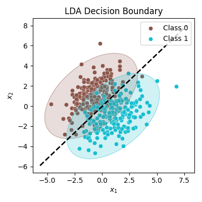
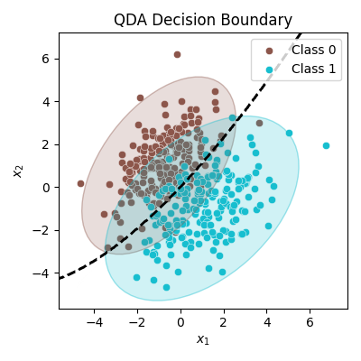

> *Adapted from an appendix of my MS thesis.*

# Linear Discriminant Analysis

## Decision Boundary Derivation

Decision theory for classification tells us that we need to know the class posteriors P(G|X) for optimal classification. Suppose f_ k(x) is the conditional density of X for class G=k, and let \pi_ k be the prior probability of class k, with \sum_ {\ell=1}^ {K}\pi_ \ell=1. Bayes theorem gives us the following [1].


P(G=k|X=x) = \frac{f_ k(x)\pi_ k}{\sum_ {\ell=1}^ {K}f_ \ell(x)\pi_ \ell}.


Many machine learning techniques are based on models for the class densities. For example, linear and quadratic discriminant analysis use Gaussian densities. More flexible Gaussian mixture models (GMMs) allow for nonlinear decision boundaries. General nonparametric density estimates for each class density allow the most flexibility. Naive Bayes models are a variant of the previous case, and assume that the inputs are conditionally independent in each class [1].

Suppose that each class density is modeled as a multivariate Gaussian [1].


f_ k(x) = (2\pi)^ {-p/2}\lvert\boldsymbol{\Sigma}_ k\rvert^ {-1/2}\exp\left(-\frac{1}{2}(x-\mu_ k)^ \top\boldsymbol{\Sigma}_ k^ {-1}(x-\mu_ k)\right).


Linear discriminant analysis (LDA) is the special case when we assume that the classes have a common covariance matrix \boldsymbol{\Sigma}_ k=\boldsymbol{\Sigma} \forall k. When we compare the log-ratio of two classes k and \ell we get an equation linear in x. The equal covariance matrices cause the normalization factors to cancel, as well as the quadratic part in the exponents. This linear log-odds function implies that the decision boundary between classes k and \ell is linear in x [1].


\begin{split}
\log\frac{P(G=k|X=x)}{P(G=\ell|X=x)} = &\log\frac{f_ k(x)}{f_ \ell(x)}+\log\frac{\pi_ k}{\pi_ \ell} \\\\
= &\log\frac{\pi_ k}{\pi_ \ell} - \frac{1}{2}(\mu_ k+\mu_ \ell)^ \top\boldsymbol{\Sigma}^ {-1}(\mu_ k-\mu_ \ell) \\\\
&+ x^ \top\boldsymbol{\Sigma}^ {-1}(\mu_ k-\mu_ \ell).
\end{split}


The linear discriminant functions are an equivalent description of the decision rule, with G(x)=\operatorname{argmax}_ k\delta_ k(x) [1].


\delta_ k(x) = x^ \top\boldsymbol{\Sigma}^ {-1}\mu_ k - \frac{1}{2}\mu_ k^ \top\boldsymbol{\Sigma}^ {-1}\mu_ k + \log\pi_ k.


In practice we do not know the parameters of the Gaussian distributions, and need to estimate them using training data [1].

  - \hat{\pi}_ k=N_ k/N, where N_ k is the number of observations from class k,

  - \hat{\mu}_ k=\sum_ {g_ i=k}x_ i/N_ k,

  - \hat{\boldsymbol{\Sigma}}=\sum_ {k=1}^ {K}\sum_ {g_ i=k}(x_ i-\hat{\mu}_ k)(x_ i-\hat{\mu}_ k)^ \top/(N-K).

In the general discriminant problem, if the \boldsymbol{\Sigma}_ k are not assumed to be equal, then the convenient cancellations in the equation do not take place. In particular the pieces quadratic in x remain. We then get quadratic discriminant analysis (QDA). The decision boundary between each pair of classes k and \ell is described by a quadratic equation \{x:\delta_ k(x)=\delta_ \ell(x)\} [1].


\delta_ k(x)= -\frac{1}{2}\log\lvert\boldsymbol{\Sigma}_ k\rvert - \frac{1}{2}(x-\mu_ k)^ \top\boldsymbol{\Sigma}_ k^ {-1}(x-\mu_ k) + \log\pi_ k.


Both LDA and QDA perform well on an amazingly large and diverse set of classification tasks. The question is why LDA and QDA have such a good track record. The reason is likely not that the data are approximately Gaussian, and in addition for LDA that the covariances are approximately equal. More likely the reason is that the data can only support simple decision boundaries such as linear or quadratic, and the estimates provided by the Gaussian models are stable. This is a bias variance tradeoff where we put up with the bias of a linear decision boundary because it can be estimated with much lower variance than more exotic alternatives [1].

## References

1. Trevor Hastie, Robert Tibshirani, Jerome Friedman (2009) *The Elements of Statistical Learning*. Springer New York.
