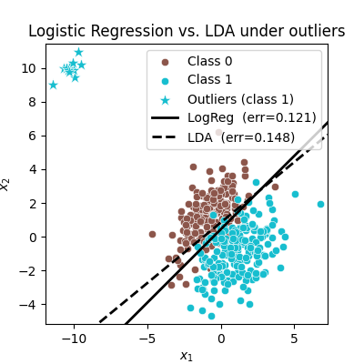

> *Adapted from an appendix of my MS thesis.*

# Logistic Regression

## Expressiveness Delineation

The logistic regression model arises from the desire to model the posterior probabilities of K classes via linear function in x, while at the same time ensuring that they sum to one and remain in [0,1]. The model has the following form. It is specified in terms of K-1 log-odds or logit transformations, reflecting the constraint that the probabilities sum to one. Although the model uses the last class as the denominator in the odds-ratios, the choice of denominator is arbitrary in that the estimates are equivalent under this choice [1].


\begin{split}
\log\frac{P(G=1|X=x)}{P(G=K|X=x)} &= \beta_ {10}+\beta_ 1^ \top x \\\\
\log\frac{P(G=2|X=x)}{P(G=K|X=x)} &= \beta_ {20}+\beta_ 1^ \top x \\\\
&\vdots \\\\
\log\frac{P(G=K-1|X=x)}{P(G=K|X=x)} &= \beta_ {(K-1)0}+\beta_ {K-1}^ \top x.
\end{split}


A reformulation shows the following [1].


\begin{split}
P(G=k|X=x) &= \frac{\exp(\beta_ {k0}+\beta_ k^ \top x)}{1 + \sum_ {\ell=1}^ {K-1}\exp(\beta_ {\ell0}+\beta_ \ell^ \top x)}, \quad k=1,\ldots,K-1, \\\\
P(G=K|X=x) &= \frac{1}{1 + \sum_ {\ell=1}^ {K-1}\exp(\beta_ {\ell0}+\beta_ \ell^ \top x)}.
\end{split}


To emphasize the dependence on the entire parameter set \theta=\\{\beta_ {10},\beta_ 1^ \top,\ldots,\beta_ {(K-1)0},\beta_ {K-1}^ \top\\}, we can denote the probabilities P(G=k|X=x)=p_ k(x;\theta). When K=2 the model is especially simple since there is only a single linear function. Logistic regression models are usually fit by maximum likelihood, using the conditional likelihood of G given X. Since P(G|X) completely specifies the conditional distribution, the multinomial distribution is appropriate. The log-likelihood for N observations is as follows where p_ k(x_ i;\theta)=P(G=k|X=x_ i;\theta) [1].


\ell(\theta) = \sum_ {i=1}^ {N}\log p_ {g_ i}(x_ i;\theta).


It is convenient to code the two-class g_ i via a 0/1 response y_ i, where y_ i=1 when g_ i=1, and y_ i=0 when g_ i=2. Let p_ 1(x;\theta)=p(x;\theta), and p_ 2(x;\theta)=1-p(x;\theta). The log-likelihood can be written as the following where \beta={\beta_ {10},\beta_ 1}, and we assume that the vector of inputs x_ i includes the constant term 1 to accommodate the intercept [1].


\begin{split}
\ell(\beta) &= \sum_ {i=1}^ {N} \Big\\{y_ i \log p(x_ i;\beta) + (1-y_ i) \log (1-p(x_ i;\beta))\Big\\} \\\\
&= \sum_ {i=1}^ {N} \left\\{y_ i\beta^ \top x_ i - \log(1+e^ {\beta^ \top x_ i})\right\\}.
\end{split}


To maximize the log-likelihood, we set its derivatives to zero, where these score equations are nonlinear in \beta [1].


\frac{\partial\ell(\beta)}{\partial\beta} = \sum_ {i=1}^ {N}x_ i(y_ i-p(x_ i;\beta))=0.


In the companion LDA post we find that the log-posterior odds of linear discriminant analysis (LDA) between two classes k and K are linear functions of x, where this linearity is a consequence of the Gaussian assumption for the class densities, as well as the assumption of a common covariance matrix [1].


\begin{split}
\log\frac{P(G=k|X=x)}{P(G=K|X=x)} = &\log\frac{\pi_ k}{\pi_ K}-\frac{1}{2}(\mu_ k+\mu_ K)^ \top\boldsymbol{\Sigma}^ {-1}(\mu_ k-\mu_ K) \\\\
&+x^ \top\boldsymbol{\Sigma}^ {-1}(\mu_ k-\mu_ K) \\\\
= &\alpha_ {k0}+\alpha_ k^ \top x.
\end{split}


The linear logistic model by construction has linear logits [1].


\log\frac{P(G=k|X=x)}{P(G=K|X=x)}=\beta_ {k0}+\beta_ k^ \top x.


It seems that the models are the same. Although they have exactly the same form, the difference lies in the way the linear coefficients are estimated. The logistic regression model is more general, in that it makes less assumptions. We can write the joint density of X and G as follows where P(X) denotes the marginal density of the inputs X [1].


P(X,G=k)=P(X)P(G=k|X).


For both LDA and logistic regression, the second term on the right has the following logit-linear form where the last class has again been arbitrarily chosen as the reference [1].


P(G=k|X=x) = \frac{\exp(\beta_ {k0}+\beta_ k^ \top x)}{1+\sum_ {\ell=1}^ {K-1}\exp(\beta_ {\ell0}+\beta_ \ell^ \top x)}.


The logistic regression model leaves the marginal density of X as an arbitrary density function P(X), and fits the parameters of P(G|X) by maximizing the conditional likelihood. That is, the multinomial likelihood with probabilities P(G=k|X). Although P(X) is totally ignored, we can think of this marginal density as being estimated nonparametrically, using the empirical distribution function which places mass 1/N at each observation [1].

With LDA we fit the parameters by maximizing the full log-likelihood based on the joint density as follows where \phi is the Gaussian density function [1].


P(X,G=k) = \phi(X;\mu_ k,\boldsymbol{\Sigma})\pi_ k.


Standard normal theory leads to the estimates \hat{\mu}_ k, \hat{\boldsymbol{\Sigma}}, and \hat{\pi}_ k given in the LDA post. Since the linear parameters of the logistic form are functions of the Gaussian parameters, we get their maximum-likelihood estimates by plugging in the corresponding estimates. However, unlike in the conditional case, the marginal density P(X) does play a role. It is a mixture density which also involves the parameters [1].


P(X) = \sum_ {k=1}^ {K}\pi_ k\phi(X;\mu_ k,\boldsymbol{\Sigma}).


The question is what role can this additional restriction play. By relying on the additional model assumptions, we have more information about the parameters, and hence can estimate them more efficiently with lower variance. For example, observations far from the decision boundary which are down-weighted by logistic regression play a role in estimating the common covariance matrix. This means that LDA is not robust to gross outliers [1].

## References

1. Trevor Hastie, Robert Tibshirani, Jerome Friedman (2009) *The Elements of Statistical Learning*. Springer New York.
