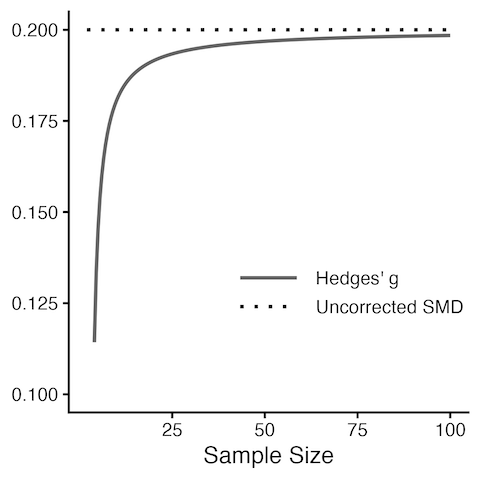

> *Adapted from an appendix of my MS thesis.*

## Effect Sizes

To perform a meta-analysis, we have to find an effect size which can be summarized across all studies. In particular, the selected effect size measure for a meta-analysis should comparable, computable, reliable, and interpretable. An effect size is defined as a metric quantifying the relationship between two entities. It captures the direction and magnitude of this relationship. For example, correlations describe how well we can predict the values of a variable through the values of another and so can be seen as a form of effect size [1].

In mathematical notation, it is common to use the Greek letter \theta as the symbol for a true effect size. More precisely, \theta_ k represents the true effect size of a study k. Importantly, the true effect size is not identical with the observed effect size that we find in the published results of the study. The observed effect size \hat{\theta} is only an estimate of the true effect size. The observed effect size of study k is therefore \hat{\theta}_ k. Note that \hat{\theta}_ k differs from \theta_ k because of the sampling error \epsilon_ k [1].


\hat{\theta}_ k = \theta_ k + \epsilon_ k.


We can assume that studies with smaller \epsilon will deliver a more precise estimate of the true effect size. When pooling the results of different studies, meta-analyses give studies with greater precision (less sampling error) a higher weight, because they are better estimators of the true effect. The question is how we can know how large the sampling error is [1].

Unsurprisingly, the true effect of a study \theta_ k is unknown, and so \epsilon_ k is also unknown. Often, however, we can approximate the expected sampling error. A common way to represent \epsilon is through the standard error (SE). The standard error is defined as the standard deviation of the sampling distribution. A sampling distribution is the distribution of a metric we get when we draw random samples with the same sample size n from our population many times [1].

### Within-Group Study

The arithmetic mean is probably the most commonly used central tendency measure, and can easily be pooled in a meta-analysis [1].


\bar{x} = \frac{\sum_ {i=1}^ {n}x_ i}{n}.


The standard error of the mean is calculated as the ratio of the sample standard deviation s and the square root of the sample size n [1].


SE_ {\bar{x}} = \frac{s}{\sqrt{n}}.


### Between-Group Study

The between-group mean difference MD_ {\text{between}} is defined as the raw, unstandardized difference of the means for two independent groups. Between-group mean differences can be calculated when a study contained at least two groups, as is usually the case in controlled trials or other types of experimental studies. In meta-analyses, mean differences can only be used when all the studies measured the outcome of interest on exactly the same scale. The mean difference is defined as the mean of group 1, \bar{x}_ 1, minus the mean of group 2, \bar{x}_ 2 [1].


MD_ {\text{between}} = \bar{x}_ 1 - \bar{x}_ 2.


The standard error can be obtained using the following formula where n_ 1 represents the sample size of group 1, n_ 2 the sample size of group 2, and s_ {\text{pooled}} the pooled standard deviation of both groups [1].


SE_ {MD_ \text{between}} = s_ {\text{pooled}}\sqrt{\frac{1}{n_ 1}+\frac{1}{n_ 2}}.


Using the standard deviation of group 1, s_ 1, and group 2, s_ 2, the value of s_ \text{pooled} can be calculated as follows [1].


s_ {\text{pooled}}=\sqrt{\frac{(n_ 1-1)s_ 1^ 2+(n_ 2-1)s_ 2^ 2}{(n_ 1-1)+(n_ 2-1)}}.


### Standardized Between-Group Study

The standardized between-group mean difference SMD_ \text{between} is defined as the difference in means between two independent groups, standardized by the pooled standard deviation s_ \text{pooled}. SMD_ \text{between} can be compared between studies, even if those studies did not measure the outcome of interest using the same instruments. In the literature, the standardized mean difference is also often called Cohen’s d. In contrast to unstandardized mean differences, SMD_ \text{between} expresses the difference between two groups in units of standard deviations. This can be achieved by dividing the raw mean difference of two groups, \bar{x}_ 1 and \bar{x}_ 2, through the pooled standard deviation s_ \text{pooled} of both groups [1].


SMD_ \text{between}=\frac{\bar{x}_ 1-\bar{x}_ 2}{s_ \text{pooled}}.


Standardized mean differences are often interpreted using the conventions of Cohen, however, these are rules of thumb at best. It is usually much better to interpret standardized mean differences based on their implications. For example, for many serious diseases even a very small statistical effect can still have a large impact on the population level [1].

  - SMD \approx 0.20: small effect.

  - SMD \approx 0.50: moderate effect.

  - SMD \approx 0.80: large effect.

The standardized error of SMD_ \text{between} can be calculated using this formula where n_ 1 and n_ 2 are the sample sizes of group 1 and group 2 [1].


SE_ {SMD_ \text{between}} = \sqrt{\frac{n_ 1+n_ 2}{n_ 1n_ 2}+\frac{SMD_ \text{between}^ 2}{2(n_ 1+n_ 2)}}.


### Effect Size Correction

The standardized mean difference has been found to have an upward bias when the sample of a study is small, especially when n\leq20. This small sample bias means that SMDs systematically overestimate the true effect size when the total sample size of a study is small, which is unfortunately often the case in practice. It is therefore sensible to correct the standardized mean differences of all included studies for small-sample bias, which produces an effect size called Hedges’ g. In this formula, n represents the total sample size of the study [1].


g = SMD \times \left(1-\frac{3}{4n-9}\right).


## References

1. Harrer, Mathias, Cuijpers, Pim, Furukawa Toshi A, Ebert, David D (2021) *Doing Meta-Analysis With R: A Hands-On Guide*. Chapman & Hall/CRC Press.
