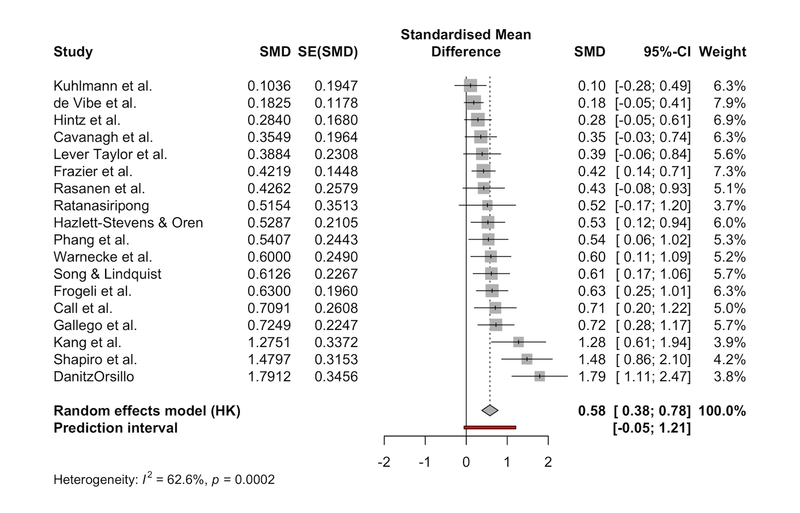

> *Adapted from an appendix of my MS thesis.*

## Forest Plots

The most common way to visualize meta-analyses is through forest plots. See the figure for an example created from a dataset containing studies examining the effect of so-called “third wave” psychotherapies on perceived stress in college students. For each study, the standardized mean difference between a treatment and control group at post-test was calculated, and Hedges’ g small sample correction was applied [1].

For each study, a graphical representation of the effect size is provided. This visualization shows the point estimate of a study on the horizontal axis. This point estimate is supplemented by a line, which represents the range of the confidence interval calculated for the observed effect size. Usually, the points estimate is surrounded by a square. The size of this square is determined by the weight of the effect size: Studies with a larger weight are given a larger square [1].

At the bottom of the plot, a diamond shape represents the average effect. The length of the diamond symbolizes the confidence interval of the pooled result on the horizontal axis. Typically, forest plots also include a vertical reference line, which indicates the point on the horizontal axis equal to no effect [1].

## References

1. Harrer, Mathias, Cuijpers, Pim, Furukawa Toshi A, Ebert, David D (2021) *Doing Meta-Analysis With R: A Hands-On Guide*. Chapman & Hall/CRC Press.
