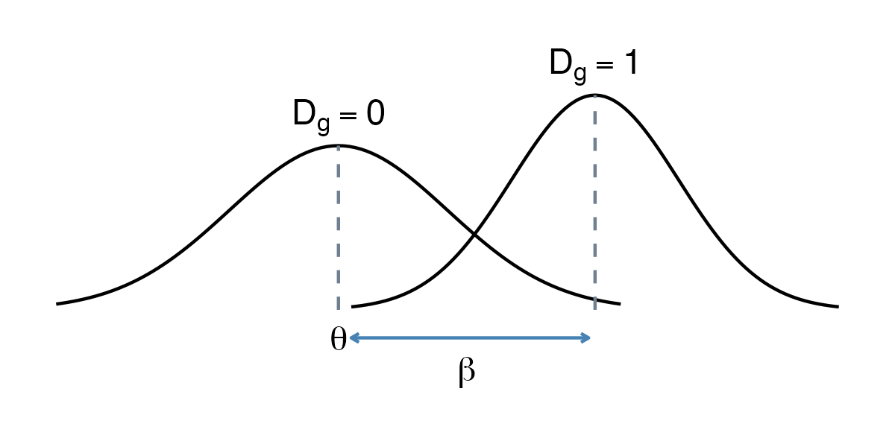
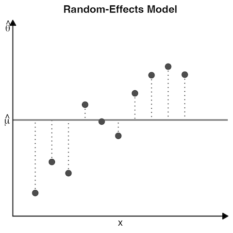
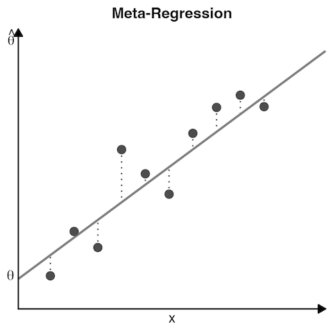

> *Adapted from an appendix of my MS thesis.*

## Meta-Regression

Usually, regression models are based on data comprising individual persons or specimens, for which both the independent x and dependent y values are measured. In meta-regression, this concept is applied to entire studies. The variable x represents characteristics of studies, for example, the year in which it was conducted. Based on this information, a meta-regression model tries to predict y, the study’s effect size [1].

In a conventional regression, we want to estimate the value y_ i of a person or specimen i using a predictor (or covariate) x_ i with a regression coefficient \beta [1].


y_ i = \beta_ 0 + \beta_ 1 x_ i.


In meta-regression, the variable y we want to predict is the observed effect size \hat{\theta}_ k of study k [1].


\hat{\theta}_ k = \theta + \beta x_ k + \epsilon_ k + \zeta_ k.


This formula contains two extra terms, \epsilon_ k and \zeta_ k. The same terms found in the random-effects model from the equation. The first one, \epsilon_ k, is the sampling error through which the effect size of a study deviates from its true effect. The second error, \zeta_ k, denotes that even the true effect size of the study is only sampled from an overarching distribution of effect sizes. Since the meta-regression formula includes a fixed effect (the \beta coefficient) as well as a random effect (\zeta_ k), the model used in meta-regression is often called a mixed-effects model [1].

### Meta-Regression with a Categorical Predictor

Subgroup analysis (from the companion Subgroup Analysis post) is nothing else than a meta-regression with a categorical predictor, where such categorical variables can be included through dummy-coding, such as the following [1].


D_ g =
\begin{cases}
0: &\text{Subgroup A} \\\\
1: &\text{Subgroup B} \\\\
\end{cases}


To specify a subgroup analysis in the form of a meta-regression, we simply have to replace the covariate x_ k with D_ g [1].


\hat{\theta}_ k = \theta + \beta D_ g + \epsilon_ k + \zeta_ k.


### Meta-Regression with a Continuous Predictor

When people speak of a meta-regression, they usually think of models in which a continuous variable is used as the predictor. The aim of the meta-regression model is to find values of \theta and \beta which minimize the difference between the predicted effect size and the true effect size of studies. Taking into account both the sampling error \epsilon_ k and between-study heterogeneity \zeta_ k, meta-regression tried to find a model that generalizes well, not only to the observed effect sizes but to the universe of all possible studies of interest [1].

An important detail about meta-regression models is that they can be seen as an extension of the random-effects model. The random-effects model is nothing but a meta-regression without a slope term. Since it contains no slope, the random-effects model simply predicts the same value for all studies. That is, the estimate of the pooled effect size \mu, which is equivalent to the intercept [1].

In the first step, the calculation of a meta-regression therefore closely resembles the one of a random-effects meta-analysis, in that the between-study heterogeneity \tau^ 2 is estimated. In the next step, the fixed weights \theta and \beta are estimated. In meta-regression, weighted least squares (WLS) is used to find the regression line that fits the data best. WLS makes sure that studies with a smaller standard error are given a higher weight [1].

If the meta-regression model fits the data well, the true effect sizes should deviate less from the regression line compared to the pooled effect \hat{\mu}. If this is the case, the predictor x explains some of the heterogeneity variance in our meta-analysis. The fit of the meta-regression model can therefore be assessed by checking how much of the heterogeneity variance it explains [1].

The predictors included in the mixed-effects model should minimize the amount of residual heterogeneity variance denoted by \hat{\tau}_ \text{MEM}^ 2. The R_ \ast^ 2 index is used to quantify the percentage of variation explained by the meta-regression model. The asterisk is added to differentiate from the R^ 2 index used in conventional regressions, since meta-regression deals with true effect sizes instead of observed data points [1].

R_ \ast^ 2 uses the amount of residual heterogeneity variance that even the meta-regression slope cannot explain. It is put in relation to the total heterogeneity that we initially found in our random-effects model \hat{\tau}_ \text{REM}^ 2. Subtracting this fraction from 1 leaves us with the percentage of between-study heterogeneity explained by the predictor, and is expressed in the equation. We can also says that it is how much the mixed-effects model has reduced the heterogeneity variance compared to the initial random-effects pooling model, in percent [1].


R_ \ast^ 2
= 1 - \frac{\hat{\tau}_ \text{MEM}^ 2}{\hat{\tau}_ \text{REM}^ 2}
= \frac{\hat{\tau}_ \text{REM}^ 2-\hat{\tau}_ \text{MEM}^ 2}{\hat{\tau}_ \text{REM}^ 2}.


Usually, we are not only in the amount of heterogeneity explained by the regression model but also if the regression weight of our predictor x is significant. Both in conventional and meta-regression, the significance of a regression weight is commonly assessed through a Wald test. This involves calculating the test statistic z, by dividing the estimate of \beta through its standard error [1].


z = \frac{\beta}{SE_ {\hat{\beta}}}.


Under the null hypothesis that \beta=0, this z\text{-statistic} follows a standard normal distribution. This allows us to calculate a corresponding p\text{-value}. Like in normal meta-analysis models, we can also use the Knapp-Hartung adjustment, which results in a test statistic based on the t\text{-distribution} [1].

## References

1. Harrer, Mathias, Cuijpers, Pim, Furukawa Toshi A, Ebert, David D (2021) *Doing Meta-Analysis With R: A Hands-On Guide*. Chapman & Hall/CRC Press.
