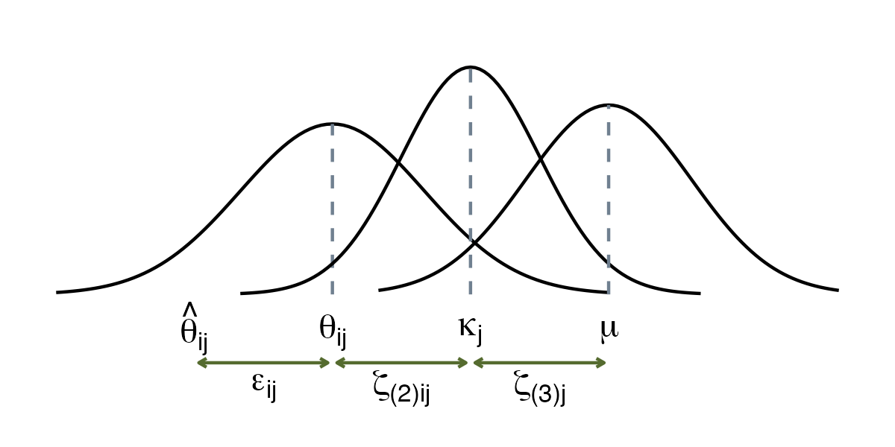

> *Adapted from an appendix of my MS thesis.*

## Multilevel Meta-Analysis

When people talk about multilevel meta-analysis, they are referring to three-level meta-analysis models. A three-level model contains three pooling steps. First, researchers themselves pool the results of individual participants in their primary studies, and report the aggregated effect size. Then, on level 2, these effect sizes are nested within several clusters denoted by \kappa. These clusters can either be within individual studies or across subgroups of studies. Lastly, pooling the aggregated cluster effects leads to the overall true effect size \mu [1].

For an example of dependence introduced within a study, consider scientists conducting a study. They may have collected data from multiple sites, compared multiple interventions to one single control group, or used different questionnaires to measure the same outcome. In all these scenarios, we can assume that some kind of dependency is introduced within the reported study [1].

As an example of dependence introduced across studies, think of a meta-analysis that focuses on some psychological mechanism. This meta-analysis includes studies which were conducted in different cultural regions of the world. Depending on the type of psychological mechanism, it could be that results of studies conducted in the same cultural region are more similar compared to those conducted in a different culture [1].

The formula for the three-level model follows. \hat{\theta}_ {ij} is an estimate of the true effect size \theta_ {ij}. The term ij can be read as some effect size i nested in cluster j. Parameter \kappa_ j is the average effect size in cluster j, and \mu the overall average population effect. In contrast to the random-effects model, this formula contains two heterogeneity terms. One is \zeta_ {(2)ij}, which stands for the within-cluster heterogeneity on level 2. The other is \zeta_ {(3)j}, the between-cluster heterogeneity on level 3 [1].


\begin{aligned}
&(\text{Level 1}) \quad \hat{\theta}_ {ij} = \theta_ {ij} + \epsilon_ {ij} \\\\
&(\text{Level 2}) \quad \theta_ {ij} = \kappa_ j + \zeta_ {(2)ij} \\\\
&(\text{Level 3}) \quad \kappa_ j = \mu + \zeta_ {(3)j} \\\\
&\hat{\theta}_ {ij} = \mu + \zeta_ {(3)j} + \zeta_ {(2)ij} + \epsilon_ {ij}. \end{aligned}


### Subgroup Analyses in Three-Level Models

We can add regression terms to a multilevel model, which leads to three-level mixed-effects model where \theta is the intercept and \beta is the regression weight of a predictor variable x [1].


\hat{\theta}_ {ij} = \theta + \beta x_ i + \zeta_ {(3)j} + \zeta_ {(2)ij} + \epsilon_ {ij}.


### Robust Variance Estimation

A hierarchical model can provide a better representation of a dataset than a conventional meta-analysis, which assumes that all effect sizes are independent. But it is still a simplification of reality. In practice, there are often forms of dependence between effect sizes that are more complex than what we have captured so far in nested models. When several effect sizes in one study are based on the same sample, we expect their sampling errors (the \epsilon_ {ij} terms in the equation) to be correlated [1].

The extended three-level architecture, the correlated and hierarchical effects (CHE) model, explicitly takes into account that some effect sizes within clusters are based on the same sample, and that their sampling errors are therefore correlated. In combination with the CHE model, the robust variance estimation (RVE) and its so-called sandwich estimator can be used to obtain robust confidence intervals and p-values [1].

For the robust variance estimator of a meta-regression of the conventional random-effects model, we can rewrite the equation so that it models dependent effect sizes, and is expressed in matrix notation [1].


\boldsymbol{t}_ j = \boldsymbol{X}_ j\boldsymbol{\beta} + \boldsymbol{u}_ j + \boldsymbol{e}_ j.


The equation tells us that effect sizes \boldsymbol{t}_ j are predicted by regression weights \boldsymbol{\beta} associated with certain covariates \boldsymbol{X}_ j. It also tells us that, besides the sampling error \boldsymbol{e}_ j, there are random effects for each study \boldsymbol{u}_ j, thus producing a mixed-effects meta-regression model. Say that n_ j is the number of effect sizes in some study j. The effect sizes in study j can then be written as the column vector \boldsymbol{t}_ j=(t_ {j,1},\ldots,t_ {j,n_ j})^ \top. Similarly, \boldsymbol{X}_ j is the design matrix containing the covariate values of some study j, where p-1 is the total number of covariates. The vector of regression coefficients \boldsymbol{\beta}=(\beta_ 1\ldots,\beta_ p)^ \top contains no subscript j, since it is assumed to be fixed across all studies [1].


\boldsymbol{X}_ j =
\begin{bmatrix}
x_ {1,1} & \cdots & x_ {1,p} \\\\
\vdots & \ddots & \vdots \\\\
x_ {n_ j,1} & \cdots & x_ {n_ j,p}
\end{bmatrix}.


Based on this formula, we can estimate the meta-regression coefficients \hat{\boldsymbol{\beta}}. To calculate confidence intervals and conduct significance tests of the coefficients, we need an estimate of their variance \boldsymbol{V}_ {\hat{\boldsymbol{\beta}}}. This can be achieved using the robust sampling variance estimator otherwise known as the sandwich estimator [1].


\boldsymbol{V}_ {\hat{\boldsymbol{\beta}}} = \left(\sum_ {j=1}^ {J}\boldsymbol{X}_ j^ \top\boldsymbol{W}_ j\boldsymbol{X}_ j\right)^ {-1} \left(\sum_ {j=1}^ {J}\boldsymbol{X}_ j^ \top\boldsymbol{W}_ j\boldsymbol{A}_ j\boldsymbol{\Phi}_ j\boldsymbol{A}_ j\boldsymbol{W}_ j\boldsymbol{X}_ j\right) \left(\sum_ {j=1}^ {J}\boldsymbol{X}_ j^ \top\boldsymbol{W}_ j\boldsymbol{X}_ j\right)^ {-1}.


The true dependence structure of the effect sizes in some study j is described by the n_ j \times n_ j covariance matrix \boldsymbol{\Phi}_ j. Unfortunately, it is rarely known to what extent effect sizes are correlated within and across studies. Therefore, it is necessary to make a few simplifying assumptions in our model. The CHE model, assumes that there is a known correlation \rho between effect sizes in the same study, and that \rho has the same value across all studies in our meta-analysis [1].

The weights \boldsymbol{W}_ j of each effect size takes the precision of effect size estimates into account before we can pool them. The optimal way to do this is to take the inverse of the variance \boldsymbol{W}_ j=\boldsymbol{\Phi}_ j^ {-1}. As mentioned, the true values of \boldsymbol{\Phi}_ j are hardly even known, so an estimate based on our model \hat{\boldsymbol{\Phi}}_ j^ {-1} is used [1].

The adjustment matrix \boldsymbol{A}_ j ensures that the estimator provides valid results even when the number of studies in our meta-analysis is small. Say, 40 studies or less. The recommended approach is to use a matrix based on the bias-reduced linearization, or CR2 method [1].

### Cluster Wild Bootstrapping

Another, and sometimes favorable way to test coefficients in our model are bootstrapping procedures. The cluster wild bootstrapping (CWB) method is well suited if the total number of studies J is our meta-analysis is small. That is, compared to RVE, which can lead to overly conservative results in small samples [1].

The cluster wild bootstrap is based on the residuals of a null model fitted without any additional covariates. Residuals are transformed using an adjustment matrix \boldsymbol{A}_ j, for example based on the CR2 method, to handle dependent effect sizes. A general algorithm for CWB looks like the following. Steps 3 to 5 are repeated R times. The bootstrap p-value can be derived as the proportion of times the bootstrap test statistic was more extreme than the one based on the original data [1].

**The Cluster Wild Bootstrapping Algorithm [1]**

1.  Calculate the full model based on the original data, and derive the test statistic of interest.

2.  Fit a null model based on the original data and extract its residuals \boldsymbol{e}.

3.  For each study j, draw a random value from a distribution, and multiply the residuals of j by this random value.

4.  Generate new, bootstrapped effect sizes by adding the transformed residuals to the predicted values of the null model based on the original data.

5.  Fit the full model again, using the bootstrapped effect sizes, and calculate the test statistic again.

## References

1. Harrer, Mathias, Cuijpers, Pim, Furukawa Toshi A, Ebert, David D (2021) *Doing Meta-Analysis With R: A Hands-On Guide*. Chapman & Hall/CRC Press.
