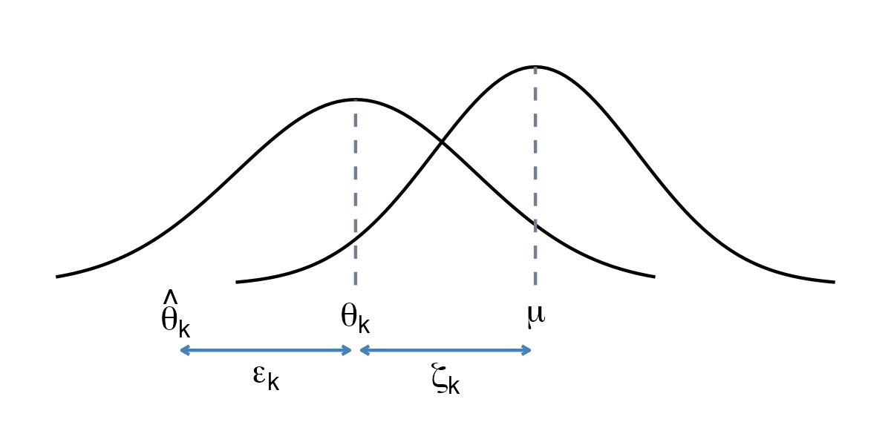

> *Adapted from an appendix of my MS thesis.*

## Pooling Effect Sizes

### Fixed-Effect Model

The fixed-effect model assumes that all effect sizes stem from a single, homogeneous population. It states that all studies share the same true effect size. According to the fixed-effect model, the only reason why a study k’s observed effect size \hat{\theta}_ k deviates from \theta is because of its sampling error \epsilon_ k. This sampling error causes the observed effect to deviate from the overall, true effect. We can describe the relationship as the following [1].


\hat{\theta}_ k = \theta + \epsilon_ k.


In the formula of the fixed-effect model, the true effect size is symbolized by \theta, not \theta_ k as in the equation. Previously, we only made statements about the true effect size of one individual study k. The fixed-effect tells us that a study’s true effect size \theta_ k, and the overall, pooled effect size \theta, are identical. The formula of the fixed-effect models tells us that there is only one reason why observed effect sizes \theta_ k deviate from the true overall effect: because of the sampling error \epsilon_ k. Furthermore, all things being equal, as the sample size becomes larger, the sampling error becomes smaller [1].

If we want to calculate the pooled effect size under the fixed-effect model, we therefore simply use a weighted average of all studies. To calculate the weight w_ k for each study k, we can use the standard error, which we square to obtain the variance s_ k^ 2 of each effect size. Since a lower variance indicates higher precision, the inverse of the variance is used to determine the weight of each study [1].


w_ k = \frac{1}{s_ k^ 2}.


Once we know the weights, we can calculate the weighted average, our estimate of the true pooled effect \hat{\theta}. This method is the most common approach to calculate average effects in meta-analyses. Since we use the inverse of the variance, it is often called inverse-variance weighting, or simply inverse-variance meta-analysis [1].


\hat{\theta} = \frac{\sum_ {k=1}^ {K}\hat{\theta}_ kw_ k}{\sum_ {k=1}^ {K}w_ k}.


### Random-Effects Model

The fixed-effect model assumes that all our studies are part of a homogeneous population. However, it is simply unrealistic that studies in a meta-analysis are always completely homogeneous. It is likely that we can anticipate considerable between-study heterogeneity in the true effects. The random-effects model assumes that there is not only one true effect size but a distribution of true effect sizes. The goal of the random-effects model is therefore not to estimate the one true effect size of all studies, but the mean of the distribution of true effects [1].

Similar to the fixed-effect model, the random-effects model starts by assuming that an observed effect size \hat{\theta}_ k is an estimator of the study’s true effect size \theta_ k, burdened by sampling error \epsilon_ k [1].


\hat{\theta}_ k = \theta_ k + \epsilon_ k.


The fact that we use \theta_ k instead of \theta is an important difference. The random-effects model only assumes that \theta_ k is the true effect size of one single study k. It stipulates that there is a second source of error, denoted by \zeta_ k. This second source of error is introduced by the fact that even the true effect size \theta_ k of study k is only part of an over-arching distribution of true effect sizes with mean \mu [1].


\theta_ k = \mu + \zeta_ k.


The random-effects model tells us that there is a hierarchy of two processes. The observed effect sizes of a study deviate from their true value because of the sampling error. But even the true effect sizes are only a draw from a universe of true effects, whose mean \mu we want to estimate as the pooled effect of our meta-analysis. We can express the random-effects mode in one line. This formula makes it clear that our observed effect size deviates from the pooled effect \mu because of two error terms, \zeta_ k and \epsilon_ k [1].


\hat{\theta}_ k = \mu + \zeta_ k + \epsilon_ k.


A crucial assumption of the random-effects model is that the size of \zeta_ k is independent of k. That is, the size of \zeta_ k is a product of chance, and chance alone. This is known as the exchangeability assumption of the random-effects model. All true effect sizes are assumed to be exchangeable in so far as we have nothing that could tell us how big \zeta_ k will be in some study k before seeing the data [1].

The challenge associated with the random-effects model is that we have to take the error \zeta_ k into account. To do this, we have to estimate the variance of the distribution of true effect sizes. This variance is known as \tau^ 2. Once we know the value of \tau^ 2, we can include the between-study heterogeneity when determining the inverse-variance weight of each effect size. In the random-effects model, we therefore calculate an adjusted random-effects weight w_ k^ \ast for each observation [1].


w_ k^ \ast = \frac{1}{s_ k^ 2+\tau^ 2}.


Using the adjusted random-effects weights, we then calculate the pooled effect size using the inverse variance method, just as we do using the fixed-effect model [1].


\hat{\theta} = \frac{\sum_ {k=1}^ {K}\hat{\theta}_ kw_ k^ \ast}{\sum_ {k=1}^ {K}w_ K^ \ast}.


There are several methods to estimate \tau^ 2, and it is an ongoing research question which of these estimators performs best for different kinds of data. Overall, estimators of \tau^ 2 fall into two categories. Some, like the DerSimonian-Laird and Sidik-Jonkman estimator, are based on closed-form expressions. The restricted maximum likelihood, Paule-Mandel estimator, and empirical Bayes estimator find the optimal value of \tau^ 2 through an iterative algorithm [1].

The Knapp-Hartung adjustments try to control for the uncertainty in our estimate of the between-study heterogeneity. While significance tests of the pooled effect usually assume a normal distribution known as Wald tests, the Knapp-Hartung method is based a t-distribution. Applying a Knapp-Hartung adjustment is usually sensible. Several studies have shown that these adjustments can reduce the chance of false positives, especially when the number of studies is small [1].

## References

1. Harrer, Mathias, Cuijpers, Pim, Furukawa Toshi A, Ebert, David D (2021) *Doing Meta-Analysis With R: A Hands-On Guide*. Chapman & Hall/CRC Press.
