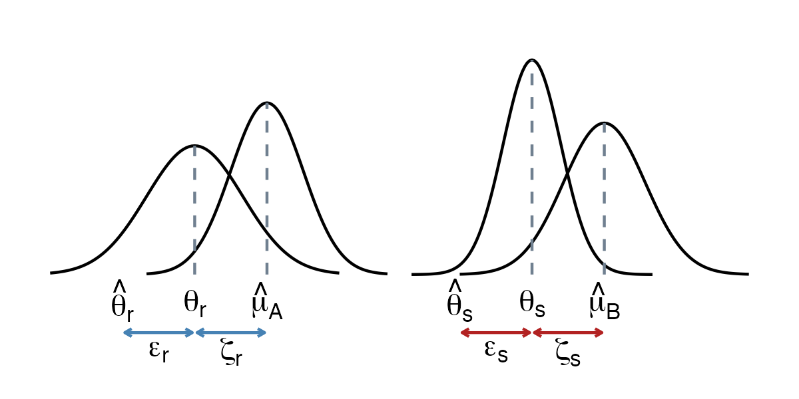

> *Adapted from an appendix of my MS thesis.*

## Subgroup Analysis

Outlier and influence analysis can help us identify which studies contribute to observed heterogeneity. They are performed after seeing the data, and often because of the results we found. These analyses may tell us that some study does not properly follow the expectations of our model, but not why this is that case. This makes it clear that we need a different approach, one that allows us to identify why a specific heterogeneity pattern can be found in our data [1].

Subgroup analyses, also known as moderator analyses, are one way to do this. They allow us to test specific hypotheses, describing why some type of study produces lower or higher effects than another. The idea behind subgroup analysis is that meta-analysis is not only about calculating an average effect size but that it can also be a tool to investigate variation in our evidence. In subgroup analyses, we see heterogeneity not merely as a nuisance but as interesting variation which may or may not be explainable by a scientific hypothesis [1].

In subgroup analyses, we hypothesize that studies in our meta-analysis do not stem from one overall population. Instead, we assume that they fall into different subgroups and that each subgroup has its own true overall effect. Our aim is to reject the null hypothesis that there is no difference in effect sizes between subgroups. The calculation of a subgroup analysis consists of two parts. First, we pool the effect in each subgroup. Subsequently, the effects of the subgroups are compared using a statistical test [1].

### Pooling the Effect in Subgroups

The first part is straightforward, as the same criteria as those for a meta-analysis without subgroups apply. If we assume that all studies in a subgroup stem from the same population, and have one shared true effect, we can use the fixed-effect mode. However, as mentioned previously, it is often unrealistic that this assumption holds in practice, even when we partition our studies into smaller subgroups [1].

Therefore, the alternative is to use a random-effects model. This assumes that studies within a subgroup are drawn from a universe of populations, the mean of which we want to estimate. The difference to a normal meta-analysis is that we conduct several separate random-effects meta-analyses, one for each subgroup. This results in a pooled effect \hat{\mu}_ g for each subgroup g [1].

Since each subgroup gets its own separate meta-analysis, estimates of the \tau^ 2 heterogeneity will also differ from subgroup to subgroup. In practice, however, the individual heterogeneity values \hat{\tau}_ g^ 2 are often replaced with a version of \tau^ 2 that was pooled across subgroups. This means that all subgroups are assumed to share a common estimate of the between-study heterogeneity. This is done for practical reasons. When the number of studies in a subgroup is small, for example k_ g<5, it is likely that the estimate of \tau^ 2 will be imprecise. In this case, it is better to calculate a pooled version of \tau^ 2 that is used across all subgroups [1].

### Comparing the Subgroup Effects

In the next step, we assess if there is a true difference between the G subgroups. The assumption is that the subgroups are different, meaning that at least one subgroup is part of a different population of studies. A way to test this is to pretend that the pooled effect of a subgroup is nothing more than the observed effect size of one large study. Similar to when assessing the heterogeneity of a normal meta-analysis, we want to know if difference in effect sizes exist only due to sampling error, or because of true differences in the effect sizes [1].

Therefore, we use the value of Q to determine if the subgroup differences are large enough to not be explainable by sampling error alone. Pretending that the subgroup effects are observed effect sizes, we calculate the value of Q. This observed Q value is compared to its expected value assuming a \chi^ 2 distribution with G-1 degrees of freedom. If the observed value of Q is substantially larger than the expected one, the p-value of the Q test will become significant. This indicates that there is a difference in the true effect sizes between subgroups [1].

Borenstein and Higgins (2013) argue that the subgroups we choose to analyze cannot always be seen as random draws from a universe of possible subgroups, but represent fixed levels of a characteristic we want to examine. Take employment status as an example. This features two fixed subgroups, “employed” and “unemployed”. Borenstein and Higgins call the model for subgroup analyses the fixed-effects (plural) model, where the word “plural” is added because we have to differentiate it from the standard fixed-effect model. It is also known in the literature as a mixed-effects model [1].

## References

1. Harrer, Mathias, Cuijpers, Pim, Furukawa Toshi A, Ebert, David D (2021) *Doing Meta-Analysis With R: A Hands-On Guide*. Chapman & Hall/CRC Press.
