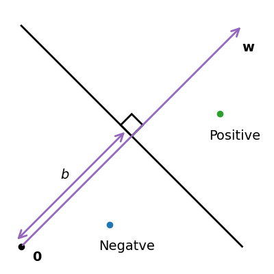
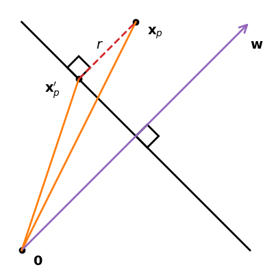
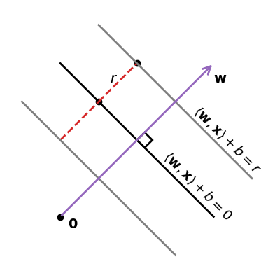

> *Adapted from an appendix of my MS thesis.*

# Support Vector Machine

The support vector machine (SVM) solves the binary classification task. It is a supervised learning task where we have a set of examples \boldsymbol{x}_ n\in\mathbb{R}^ D along with their corresponding binary labels y_ n\in\\{1,-1\\}. Given a training set \\{(\boldsymbol{x}_ 1,y_ 1),\ldots,(\boldsymbol{x}_ N,y_ N)\\} we would like to estimate parameters of the model that will give the smallest classification error. In the case of binary classification, we divide the vector space \mathbb{R}^ D into two parts corresponding to the positive and negative classes. In the following we consider a particularly convenient partition, which is to linear split the space using a hyperplane [1].

![Example of an SVM linearly separating two classes of data points by a margin [2].](assets/svm-hyperplane/svm.png)

## Separating Hyperplane

Let example \boldsymbol{x}\in\mathbb{R}^ D be an element of the data space, and consider a function parameterized by \boldsymbol{w}\in\mathbb{R}^ D and b\in\mathbb{R} [1].


\begin{aligned}
f &: \mathbb{R}^ D\to\mathbb{R} \\\\
\boldsymbol{x} &\mapsto f(\boldsymbol{x}) = \langle\boldsymbol{w},\boldsymbol{x}\rangle + b.\end{aligned}


We define the hyperplane that separates the two classes in our binary classification problem as follows where the vector \boldsymbol{w} is normal to the hyperplane and b is the intercept [1].


\\{\boldsymbol{x}\in\mathbb{R}^ D : f(\boldsymbol{x})=0\\}.


We can derive that \boldsymbol{w} is a normal vector to the hyperplane by choosing any two examples \boldsymbol{x}_ p and \boldsymbol{x}_ q on the hyperplane and showing that the vector between them is orthogonal to \boldsymbol{w}. Since we have chosen \boldsymbol{x}_ p and \boldsymbol{x}_ q to be on the hyperplane, this implies that f(\boldsymbol{x}_ p)=0 and f(\boldsymbol{x}_ q)=0 and hence \langle\boldsymbol{w},\boldsymbol{x}_ p-\boldsymbol{x}_ q\rangle=0. Therefore, we obtain that \boldsymbol{w} is orthogonal to any vector on the hyperplane [1].


f(\boldsymbol{x}_ p) - f(\boldsymbol{x}_ q)
= (\langle\boldsymbol{w},\boldsymbol{x}_ p\rangle + b) - (\langle\boldsymbol{w},\boldsymbol{x}_ q\rangle + b) \\\\
= \langle\boldsymbol{w},\boldsymbol{x}_ p-\boldsymbol{x}_ q\rangle
= 0.


When presented with a test example, we classify the example as positive or negative depending on the side of the hyperplane on which it occurs. Note that the equation not only defines a hyperplane, it additionally defines a direction. In other words, it defines the positive and negative side of the hyperplane. Geometrically, the positive examples lie above the hyperplane and the negative examples below the hyperplane. When training the classifier, we want to ensure that the examples with positive labels are on the positive side, and the examples with negative labels are on the negative side [1].


\begin{aligned}
\langle\boldsymbol{w},\boldsymbol{x}_ n\rangle+b &\geq 0 \quad \text{when} \quad y_ n=1 \\\\
\langle\boldsymbol{w},\boldsymbol{x}_ n\rangle+b &< 0 \quad \text{when} \quad y_ n=-1.\end{aligned}


Equivalently, these two conditions can be expressed in a single equation [1].


y_ n(\langle\boldsymbol{w},\boldsymbol{x_ n}\rangle+b)\geq0.


For a dataset \\{(\boldsymbol{x}_ 1,y_ 1),\ldots,(\boldsymbol{x}_ N,y_ N)\\} that is linearly separable, we have infinitely many candidate hyperplanes, and therefore classifiers, that solve our classification problem without any training error. To find a unique solution, we can choose the separating hyperplane that maximizes margin between the positive and negative examples. In other words, we want the positive and negative examples to be separated by a large margin. For this purpose, we can make use of the fact that the closest point on the hyperplane to a given point \boldsymbol{x}_ n is obtained by the orthogonal projection [1].

Consider a hyperplane \langle\boldsymbol{w},\boldsymbol{x}\rangle+b and an example \boldsymbol{x}_ p that is on the positive side of the hyperplane so that \langle\boldsymbol{w},\boldsymbol{x}\rangle+b>0. We want to compute the distance r>0 of \boldsymbol{x}_ p from the hyperplane. We do so by considering the orthogonal projection of \boldsymbol{x}_ p onto the hyperplane, which we denote by \boldsymbol{x}_ p'. Since \boldsymbol{w} is orthogonal to the hyperplane we know that the distance r is just a scaling of the length of this vector \boldsymbol{w}. If the length of \boldsymbol{w} is known, then we can use this scaling factor r to work out the absolute distance between \boldsymbol{x}_ p and \boldsymbol{x}_ p'. For convenience, we use a vector of unit length \frac{\boldsymbol{w}}{\\|\boldsymbol{w}\\|} [1].


\boldsymbol{x}_ p = \boldsymbol{x}_ p'+r\frac{\boldsymbol{w}}{\\|\boldsymbol{w}\\|}.


Say that we would like the positive examples to be further than r from the hyperplane, and the negative examples to be further than distance r in the negative direction from the hyperplane. In other words, we combine the requirements that examples are at least r distance away from the hyperplane in the positive and negative directions into one single inequality. Since we are interested only the direction, we add an assumption to our model that the parameter vector \boldsymbol{w} is of unit length \\|\boldsymbol{w}\\|, where we use the Euclidean norm \\|\boldsymbol{w}\\|=\sqrt{\boldsymbol{w}^ \top\boldsymbol{w}}. This assumption allows a more intuitive interpretation of the distance r [1].

Collecting these three requirements into a single constrained optimization problem, we obtain the following objective [1].


\begin{split}
\max_ {\boldsymbol{w},b,r} \quad &r \\\\
\text{subject to} \quad &y_ n(\langle\boldsymbol{w},\boldsymbol{x}_ n\rangle+b)\geq r, \\\\
&\\|\boldsymbol{w}\\|=1, \; r>0.
\end{split}


## Probability Calibration

The SVM is a binary classifier that does not naturally lend itself to a probabilistic interpretation. Platt scaling is one approach to converting the raw output of the linear function into a calibrated class probability estimate that involves an additional calibration step [1]. The idea is to compute q=\sigma(az+b), where z is the log-odds, or logit, of the SVM scores, a and b are estimated via maximum likelihood on a validation set, and q=\sigma(\cdot) comes from logistic regression [3].

In other words, for the binary classification case, Platt scaling uses logistic regression on the SVM scores, fit by an additional cross-validation on the training data. The cross-validation involved in Platt scaling is an expensive operation for large datasets [2]. Platt’s method is also known to have theoretical issues. This method can easily overfit resulting in overconfident calibrated probabilities [3].

Naturally, one could take a more Bayesian view of the classifier output by estimating a posterior distribution using Bayesian logistic regression. The Bayesian view also includes the specification of the prior, which includes design choices such as conjugacy with the likelihood. Additionally, one could consider latent functions as priors, which results in Gaussian process classification (a topic for a future post) [1].

## References

1. Deisenroth, Marc Peter, Faisal, Aldo, Ong, Cheng Soon (2020) *Mathematics for Machine Learning*. Cambridge University Press.
2. Pedregosa, F., Varoquaux, G., Gramfort, A., Michel, V., Thirion, B., Grisel, O., Blondel, M., Prettenhofer, P., Weiss, R., Dubourg, V., Vanderplas, J., Passos, A., Cournapeau, D., Brucher, M., Perrot, M., Duchesnay, E. (2011) *Scikit-learn: Machine Learning in Python*. Journal of Machine Learning Research.
3. Kevin P. Murphy (2023) *Probabilistic Machine Learning: Advanced Topics*. MIT Press.
