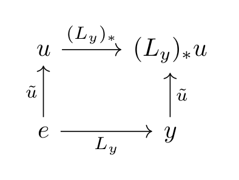
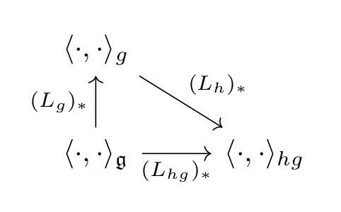
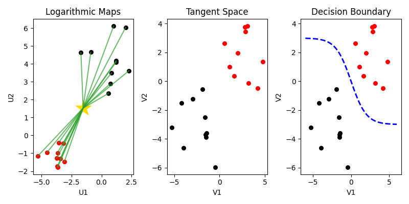

> *Adapted from an appendix of my MS thesis. Equations render via Dev.to's KaTeX support.*

# Tangent Space

Current state-of-the-art (SOTA) machine learning (ML) for electroencephalogram (EEG) uses across channel covariance matrices and Riemannian geometric statistics on the symmetric positive definite (SPD) manifold for classification [1, 2]. These methods either discriminate directly on the SPD manifold or in the vector space that is tangent to the manifold. In this section we analyze the latter method of discrimination that performs classification in the tangent space (TS) of the SPD manifold.

## Definitions

A manifold is a collection of points that locally, but not globally, resembles Euclidean space. A Riemannian metric is defined by a smoothly varying collection of scalar products \langle \cdot,\cdot \rangle_ x in each tangent space T_ x\mathcal{M} at points x on a manifold \mathcal{M}. For example, the inner product gives a norm \|\cdot\|_ x\colon T_ x\mathcal{M}\to\mathbb{R} by \|v\|^ 2_ x=\langle v,v \rangle_ x. The shortest distance between two points on a manifold is a geodesic \gamma(t), and it is computed by integrating the norm along its curve [3].

![Example of a tangent space, manifold, and geodesic. (Left) The tangent space T_ x\mathcal{M} that is a vector space at some point x on a manifold \mathcal{M}. (Right) The curved manifold \mathcal{M} with geodesic \gamma(t) from the point x to some other point y on the manifold.](assets/ts/geodesic.png)

We can map vectors in the tangent space to the manifold using geodesics. The vector v \in T_ x\mathcal{M} can be mapped to the point of the manifold that is reached after a unit time t=1 by the geodesic \gamma(t) starting at x with initial velocity \gamma'(0) = v. This mapping \text{Exp}_ x \colon T_ x\mathcal{M}\to\mathcal{M} is called the exponential map where \text{Exp}_ x(v)=\gamma(1). The inverse of the exponential map is the logarithmic map \text{Log}_ x(y) and is the smallest vector v as measured by the Riemannian metric so that \text{Exp}_ x(v)=y [3].

In general, finding geodesics involves solving second-order ordinary differential equations (ODEs) [3]. However, SPD matrices have additional Lie group structure that can be used to simplify algorithms and speed up computations of Riemannian metrics and geodesics [4]. A group is a set G with an associative binary operation satisfying (xy)z=x(yz) for all x,y,z \in G, contains an identity element e \in G so that ex=xe=x for all x \in G, and contains an inverse element x^ {-1} \in G for each x \in G where x^ {-1}x=xx^ {-1}=e. A Lie group is a smooth manifold and also a group [3].

For each x,y in a Lie group G, left-translations by y are denoted L_ y\colon x \mapsto yx. The differential (L_ y)_ \ast of left-translation maps the tangent space T_ xG to the tangent space T_ {yx}G. In particular, (L_ y)_ \ast maps any vector u \in T_ eG to the vector (L_ y)_ \ast u \in T_ yG. The vector field \tilde{u}(y) = (L_ y)_ \ast u is called left-invariant since it is invariant under left-translations \tilde{u} \circ L_ y = (L_ y)_ \ast \tilde{u} for all y \in G [3]. In other words, pullback to the identity and pushforward to another object are commutative under left-translation.


\begin{aligned}
(L_ y)_ \ast\tilde{u}(x) &= (L_ y)_ \ast(L_ x)_ \ast u \\
&= (L_ {yx})_ \ast u \\
&= \tilde{u}(yx) \\
& = \tilde{u}(L_ yx) \\
&= (\tilde{u} \circ L_ y)x.

\end{aligned}


The left-translation maps give a useful way of defining Riemannian metrics on Lie groups. By definition the tangent space T_ eG of a Lie group G at the identity element, typically denoted \mathfrak{g}, is called a Lie algebra. Given an inner product \langle \cdot,\cdot \rangle_ \mathfrak{g} on the Lie algebra, we can extend it to an inner product on tangent spaces at all elements of the group by setting \langle u,v \rangle_ g = \langle (L_ {g^ {-1}})_ \ast u, (L_ {g^ {-1}})_ \ast v \rangle_ \mathfrak{g}. This defines a left-invariant Riemannian metric on G since \langle (L_ h)_ \ast u, (L_ h)_ \ast v \rangle_ {hg} = \langle u,v \rangle_ g for any u,v\in T_ gG [3].


\begin{aligned}
\langle (L_ h)_ \ast u, (L_ h)_ \ast v \rangle_ {hg} &= \langle (L_ {(hg)^ {-1}})_ \ast(L_ h)_ \ast u, (L_ {(hg)^ {-1}})_ \ast(L_ h)_ \ast v \rangle_ \mathfrak{g} \\
&= \langle (L_ {(hg)^ {-1}h})_ \ast u, (L_ {(hg)^ {-1}h})_ \ast v \rangle_ \mathfrak{g} \\
&= \langle (L_ {g^ {-1}h^ {-1}h})_ \ast u, (L_ {g^ {-1}h^ {-1}h})_ \ast v \rangle_ \mathfrak{g} \\
&= \langle (L_ {g^ {-1}})_ \ast u, (L_ {g^ {-1}})_ \ast v \rangle_ \mathfrak{g} \\
&= \langle u,v \rangle_ g.
\end{aligned}


For a matrix P\in\mathbb{R}^ {n \times n} and any non-zero vector x\in\mathbb{R}^ n, if P=P^ \top and x^ \top P x>0, then P is an SPD matrix [5]. The space of SPD matrices is a smooth manifold, and not a vector space since it lacks an additive identity, additive inverses, and zero and negative real scalar multiplication [4]. The SPD manifold \text{Sym}_ n^ + of all SPD matrices is a Lie group with matrix multiplication as its group operation [3]. Therefore, we can derive invariant metrics and geodesics on the SPD manifold.

Let A be a matrix from the general linear group \text{GL}(n) of non-singular matrices. Then APA^ \top\in\text{Sym}_ n^ + since (APA^ \top)^ \top = (A^ \top)^ \top P A^ \top = APA^ \top and for any non-zero vector x\in\mathbb{R}^ n then x^ \top(APA^ \top)x = (x^ \top A)P(A^ \top x) = (A^ \top x)^ \top P (A^ \top x) > 0. Given two matrices P,Q\in\text{Sym}_ n^ + we can derive the distance between them as a norm from the identity by choosing A=P^ {-1/2} [4]. That is, with left-invariance we can pullback to the identity before pushforward.


\text{dist}(P,Q) = \text{dist}(\text{Id},P^ {-1/2}QP^ {-1/2}) = N(P^ {-1/2}QP^ {-1/2}).


By left-invariance at the identity of a Lie group we have the vector field \tilde{u}(x)=(L_ x)_ \ast u. The geodesic starting at the identity e with initial velocity u satisfies x(0)=e and x'(t)=\tilde{u}(x(t)). For matrix groups, this ODE becomes x'(t)=x(t)u and is uniquely solved by the matrix exponential x(t)=\text{exp}(tu). In other words, the exponential map is the matrix exponential and its inverse the logarithmic map is the matrix logarithm [3].

![The exponential map \text{Exp}_ x(v)=\gamma(1)=y produces the point on the manifold \mathcal{M} reached after a unit time t=1 along the geodesic \gamma(t) starting at point x with initial velocity \gamma'(0)=v. The logarithmic map \text{Log}_ x(y)=v is its inverse and produces the initial velocity needed to reach y from x after the unit time t=1. On \text{Sym}_ n^ + the exponential map is the matrix exponential and the logarithmic map is the matrix logarithm.](assets/ts/ode.png)

From the figure take R=P^ {-1/2}QP^ {-1/2}. The matrix logarithm \log(R) produces the vector for the norm N(R). This norm is given by the Frobenius norm \|\cdot\|_ F. Furthermore, since R is SPD, it has eigendecomposition R=V \Lambda V^ \top where \Lambda=\text{diag}(\lambda_ 1,\ldots,\lambda_ n) and \lambda_ i>0. By the matrix logarithm \log(R)= V\text{diag}(\log\lambda_ 1,\ldots,\log\lambda_ n)V^ \top. Therefore, by the orthogonal invariance of the Frobenius norm, the norm N(R) can be written as the square root of the sum of squared eigenvalue logarithms [4].


\text{dist}(P,Q) = N(P^ {-1/2}QP^ {-1/2}) = \| \log(R) \|_ F = \left( \sum_ {i=1}^ n \log^ 2\lambda_ i\right)^ {1/2}.


the figure gives a closed form solution for the distance between two SPD matrices on \text{Sym}_ n^ +. Not only is it exact and so does not require optimization, but it can be computed in the vector space of the tangent space and so does not require integration on the curve. Furthermore, by the nature of logarithms we see that matrices with zero or negative eigenvalue are in fact infinite distance from SPD matrices on \text{Sym}_ n^ +, contrary to Euclidean space and metrics [4].

We can also find closed form solutions for the logarithmic and exponential maps on \text{Sym}_ n^ +. Rather than solve for the norm of the logarithmic map, we can solve for the vector itself. This is done by pushing forward to P after we pulled back to the identity from P. Furthermore, as the inverse of the logarithmic map, the closed form solution for the exponential map takes a vector as input and outputs the point on \text{Sym}_ n^ + reached after unit time elapsed along the geodesic.


\text{Log}_ P(Q) = P^ {1/2}\log(P^ {-1/2}QP^ {-1/2})P^ {1/2}.



\text{Exp}_ P(W) = P^ {1/2}\exp(P^ {-1/2}WP^ {-1/2})P^ {1/2}.


At the foundation of statistics is the notion of a distance. The closed form solution of the mean in Euclidean space \frac{1}{N}\sum_ {i=1}^ N X_ i relies on the additive structure of vector space and does not generalize to Riemannian space. However, there are defining properties of the mean that do generalize: The geometric mean is a least-squares centroid that minimizes the sum-of-squared distances. A natural strategy for computing the geometric mean is gradient descent optimization [6].


\bar{y} = \operatorname*{arg\,min}_ {y\in\mathcal{M}}\sum_ {i=1}^ N \text{dist}(y,y_ i)^ 2.


The exponential and logarithmic map, distance, and mean on \text{Sym}_ n^ + are common Riemannian geometric statistics used by SOTA ML for EEG that takes across channel sample covariance matrices for classification [1, 2]. The minimum distance to the mean (MDM) classifier is trained by memorizing the mean of each class and is tested by predicting classes based on the minimum distance to the memorized means [1]. All operations occur on the SPD manifold. In the next section we describe in more detail an alternative algorithm that performs classification in the tangent space of \text{Sym}_ n^ +.

## Example

Consider two three-dimensional tensors of EEG recordings X_ 1,X_ 2\in\mathbb{R}^ {p \times q \times r} from separate classes where the dimensions p,q,r are the trials, channels, and time, respectively. For each trial, let sample covariance matrices (SCMs) be computed between channels across time so that \Sigma_ 1^ {(k)},\Sigma_ 2^ {(k)}\in\mathbb{R}^ {q \times q} for k=1,\ldots,p. Assume each SCM is conditioned so that it is SPD. Furthermore, let us define \bar{\Sigma}_ 1,\bar{\Sigma}_ 2\in\mathbb{R}^ {q \times q} as geometric mean SCMs averaged across all trials k of each class.

![Example of our data preprocessing pipeline. (Left) We receive a three-dimensional tensor (\text{trials}\times\text{channels}\times\text{time}) of raw EEG signals recorded from a brain-computer interface session. (Center) We transform each trial of signals into between channel sample covariance matrices (SCMs). (Right) We represent SCMs on the SPD manifold where they are naturally clustered by their label and the golden star is the geometric mean whose tangent space we map all SCMs to for ML in vector space.](assets/ts/pipeline.png)

With the geometric mean of each class \bar{\Sigma}_ 1,\bar{\Sigma}_ 2\in\text{Sym}_ n^ + we define \bar{\Sigma}\in\text{Sym}_ n^ + as the geometric mean of these means. Then, using the logarithmic map we find the vectors between all points in all clusters to \bar{\Sigma}. We represent these vectors in the tangent space T_ {\bar{\Sigma}}\text{Sym}_ n^ + of the mean point \bar{\Sigma}. This linearization of SPD matrices is done in a way that respects the metric space of \text{Sym}_ n^ +. Once in the tangent space T_ {\bar{\Sigma}}\text{Sym}_ n^ + we can train standard ML algorithms that are optimized for vector space.

Once in the tangent space T_ {\bar{\Sigma}}\text{Sym}_ n^ + we can train standard ML algorithms that are optimized for vector space. This method of linearization from the space of SPD matrices to vector space is the standard used by software libraries like PyRiemann [7]. As of now, SOTA EEG classifiers are those that learn and predict in the tangent space of the SPD manifold rather than on the manifold itself [1, 2]. An explanation for this is that machine learning is traditionally optimized for vector space.

## References

1. Barachant, Alexandre, Bonnet, Stéphane, Congedo, Marco, Jutten, Christian (2012) *Multiclass Brain–Computer Interface Classification by Riemannian Geometry*. IEEE Transactions on Biomedical Engineering.
2. Sylvain Chevallier, Emmanuel K. Kalunga, Quentin Barthélemy, Florian Yger (2018) *Riemannian Classification for SSVEP-Based BCI: Offline versus Online Implementations*. CRC Press.
3. Stefan Sommer, Tom Fletcher, Xavier Pennec (2020) *Introduction to differential and Riemannian geometry*. Academic Press.
4. Xavier Pennec (2020) *Manifold-valued image processing with SPD matrices*. Academic Press.
5. Kevin P. Murphy (2022) *Probabilistic Machine Learning: An Introduction*. MIT Press.
6. Tom Fletcher (2020) *Statistics on manifolds*. Academic Press.
7. Alexandre Barachant, Quentin Barthélemy, Jean-Rémi King, Alexandre Gramfort, Sylvain Chevallier, Pedro L. C. Rodrigues, Emanuele Olivetti, Vladislav Goncharenko, Gabriel Wagner vom Berg, Ghiles Reguig, Arthur Lebeurrier, Erik Bjäreholt, Maria Sayu Yamamoto, Pierre Clisson, Marie-Constance Corsi, Igor Carrara, Apolline Mellot, Bruna Junqueira Lopes, Brent Gaisford, Ammar Mian, Anton Andreev, Gregoire Cattan, Arthur Lebeurrier (2025) *pyRiemann*. Zenodo.
